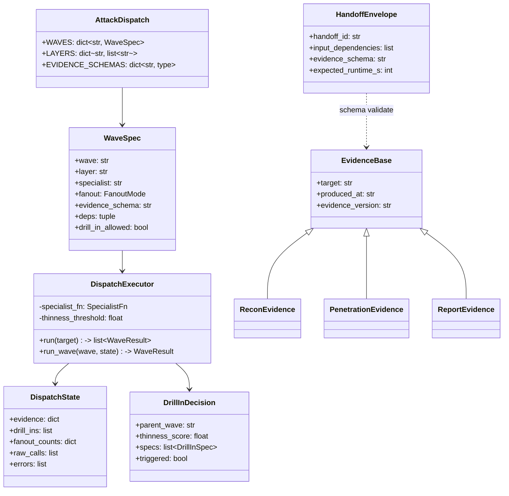
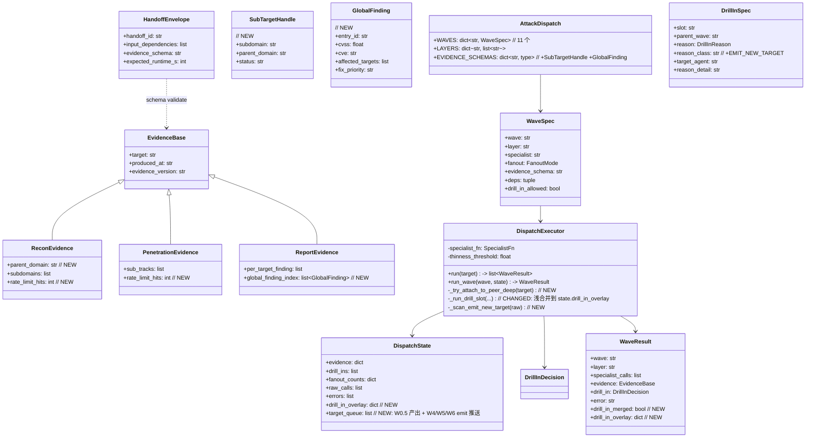
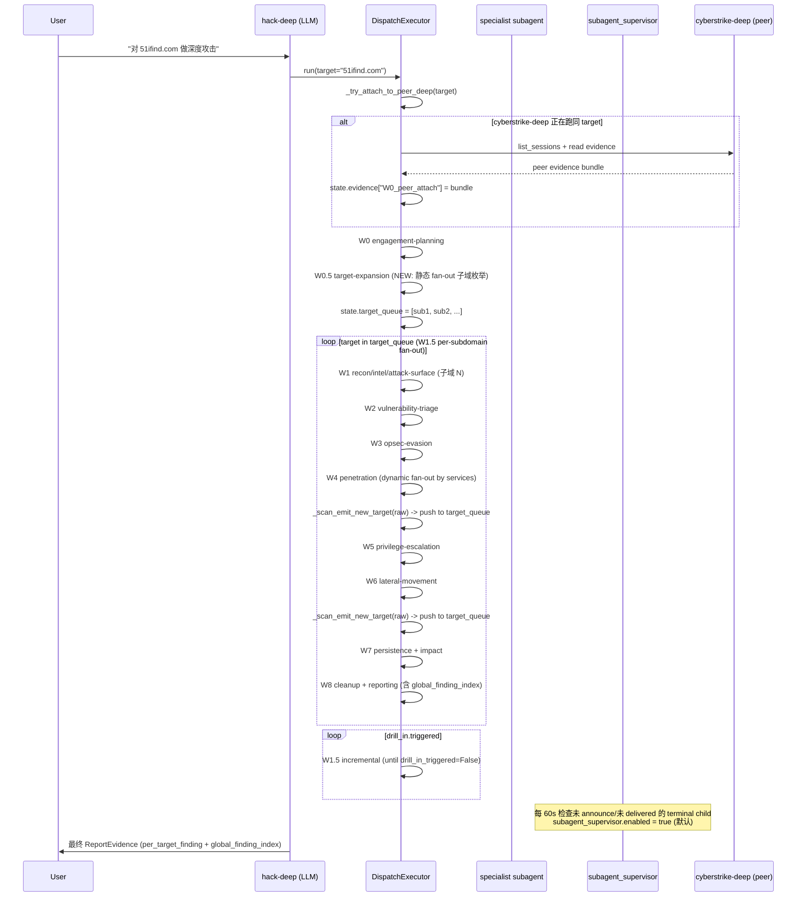

# Delivery Solution: hack-deep 全面优化（10 项，跳过 ROE + nuclei）

## 1. Metadata
| Field | Value |
| --- | --- |
| Topic | hack-deep 全面优化（10 项，跳过 ROE + nuclei） |
| Requirement Source Type | freeform（用户已经在前一轮评估中列出 12 项并在本轮明确跳过 2 项后给出"开始"指令） |
| Source Inputs | 上一轮评估对话的 12 项建议；本轮用户排除 #5（cve 映射）、#9（ROE 强制）、任何 nuclei 相关；其余 10 项全部要做 |
| Scope Mode | named-subset（10 个明确编号的优化项） |
| Execution Status | confirmed（用户已说"开始"） |
| Last Updated | 2026-06-07 |

## 2. Goal
把 hack-deep 从"单目标 9 波编排骨架"升级为"主域 → 子域列表 → 每子域全端口/全服务/全漏洞/深度 Web 攻击"的实战形态：加目标展开 + 反馈环 + 现代 Web/子域工具链 + 跨 deep evidence attach + 全局漏洞视图 + 速率控制 + drill-in 合并语义 + supervisor 默认开 + 顶层文档。明确**不做** ROE 强制和任何 nuclei 相关能力。

## 3. In Scope
- **S1** waves.py 新增 W0.5 target-expansion（静态 fan-out）+ W1.5 per-subdomain fan-out（动态 fan-out，按子域数拆桶）
- **S2** evidence.py 给 `ReconEvidence` 加 `parent_domain` 字段；新增 `SubTargetHandle` schema
- **S3** executor.py 实现 W0.5 / W1.5 fan-out 逻辑、子 hack-deep 子任务入口
- **S4** evidence.py 给 `ReconEvidence` / `PenetrationEvidence` 加 `rate_limit_hits: int` 字段（速率控制可视化）
- **S5** evidence.py 给 `ReportEvidence` 加 `global_finding_index: list[GlobalFinding]`；新增 `GlobalFinding` schema（cvss / cve / affected_targets / fix_priority）
- **S6** drill_in.py 新增第四种 reason class `EMIT_NEW_TARGET`；executor.py 在 W4/W5/W6 raw 输出里扫描 emit_new_target 声明并推回 target-expansion 队列；增加"两轮"机制（W1 全量 → W1.5 增量 → 直至 drill_in_triggered=False）
- **S7** executor.py 给 `WaveResult` 加 `drill_in_merged: bool` + `drill_in_overlay: dict` 字段；`_run_drill_slot` 末尾浅合并 raw 到 `state.drill_in_overlay[<parent_wave>]`，**不**覆盖父 evidence
- **S8** executor.py 新增 helper `_try_attach_to_peer_deep(target)`：开工前查 cyberstrike-deep 是否在跑同 target；存在则把它 evidence bundle 写到 `state.evidence["W0_peer_attach"]` 作为 W0 起点
- **S9** scripts/add_subdomain_enum_skills.py：9 个子域枚举 skill（subfinder / assetfinder / chaos / shuffledns / dnsx / httpx / subjack / cero / github-subdomains），沿用 `scripts/migrate_cyberstrikeai_skills.py` 的 schema
- **S10** scripts/add_web_attack_skills.py：22 个现代 Web 攻击 skill（katana / jsluice / linkfinder / xnLinkFinder / subjs / arjun / paramspider / x8 / kiterunner / graphql-introspector / clairvoyance / batchql / wsrepl / nomore403 / bypass-403 / smuggler / h2csmuggler / wpscan / droopescan / xsstricky / evilginx2 / mobsf / objection），沿用同 schema
- **S11** 把 S9/S10 的新 skill bins 追加到 recon / penetration specialist 的 SOUL.md 工具清单（运行时写 `~/.opensquilla/agents/<id>/SOUL.md`）
- **S12** scripts/clone_cyberstrike_to_hack_deep.py 在 `_register_in_config` 末尾自动 patch `~/.opensquilla/config.toml` 的 `[subagent_supervisor] enabled = true`；在 ATTRIBUTION.md 记录这次自动开启
- **S13** 新建 `docs/hack-deep.md`：4 层 9 波示意图、Typed Envelope 字段、drill-in 触发规则、supervisor 角色、典型任务 timeline、新增的 W0.5/W1.5 + 反馈环说明
- **S14** 在主 `README.md` 加一行 + 链接到 `docs/hack-deep.md`（**不动** SECURITY.md）
- **S15** tests/test_attack_dispatch.py 补 W0.5 / W1.5 / SubTargetHandle / GlobalFinding / drill_in_overlay / rate_limit_hits 单测
- **S16** tests/test_hack_deep_clone.py 加一条断言：`subagent_supervisor.enabled == True`

## 4. Out of Scope
- ❌ ROE 强制 / roe-v1 必填字段（用户明确不要）
- ❌ 任何 nuclei 相关（cve 映射、takeover 模板、skill、工具清单条目）
- ❌ 修改 [SECURITY.md](SECURITY.md)（用户没要求 + 不要授权声明）
- ❌ 修改 cyberstrike-deep 已有配置（clone 脚本明确"co-exists with cyberstrike-deep as a peer"）
- ❌ 修改 [subagent_contract.py](src/opensquilla/agents/subagent_contract.py) 已有 API
- ❌ 改 [src/opensquilla/attack_dispatch/SKILL.md](src/opensquilla/attack_dispatch/SKILL.md) 中关于 4 层 9 波的描述（仅追加新波段落，不重写）

## 5. Constraints And Principles
- 所有 evidence schema 改动必须后向兼容（list 字段无 max_length，添加新字段用 Optional 兜底）
- 所有新增 SOUL/ATTRIBUTION 改动写到运行时生成的 `~/.opensquilla/agents/<id>/`，不直接改仓库里 cyberstrike-deep 的源
- skill 沿用 `scripts/migrate_cyberstrikeai_skills.py` 同一套 schema：name/description/always/triggers/provenance/metadata.opensquilla{risk, capabilities, requires.bins[], install[{kind:brew/uv,...}]}
- 单文件不超过 1000 行（waves.py / evidence.py / executor.py 现有都 < 700 行，本轮会增长但不会超）
- 优先简单实现，不引入新抽象层
- 严格遵守 clean code：可读命名、单一职责、显式 barrier
- 每个新增 schema / 每个新波都加单测

## 6. Current Architecture
- **hack-deep agent**：4 层 × 9 波编排者，禁用所有执行型工具，仅允许 `sessions_spawn` / `sessions_yield` / `write_todos` / `read`
- **attack_dispatch 包**（[src/opensquilla/attack_dispatch/](src/opensquilla/attack_dispatch/)）：
  - `envelope.py` — Typed Task Envelope + Result Marker 解析
  - `evidence.py` — 13 个 evidence schema（Pydantic v2）
  - `waves.py` — 9 波 DAG 注册表 + drill-in 槽表
  - `drill_in.py` — drill-in 触发决策（薄度打分 + reason class 选取）
  - `executor.py` — 同步、可单测的 9 波执行器
- **subagent_supervisor**（[src/opensquilla/gateway/subagent_supervisor.py](src/opensquilla/gateway/subagent_supervisor.py)）— 看门狗 cron，每 60s 检查 stuck/undelivered terminal child
- **clone 脚本**（[scripts/clone_cyberstrike_to_hack_deep.py](scripts/clone_cyberstrike_to_hack_deep.py)）— 把 cyberstrike-deep 克隆成 hack-deep，注入 SOUL v3.1 / ATTRIBUTION
- **skill 迁移脚本**（[scripts/migrate_cyberstrikeai_skills.py](scripts/migrate_cyberstrikeai_skills.py)）— 把 21 个 CyberStrikeAI skill 写进 `~/.opensquilla/skills/`
- **运行时**：`~/.opensquilla/agents/hack-deep/`（SOUL/AGENTS/ATTRIBUTION/HEARTBEAT/IDENTITY/MEMORY/TOOLS/USER）+ 13 个 specialist workspace + 21 个 skill

## 7. Current Class Diagram



## 8. Current Sequence Diagram

```mermaid
sequenceDiagram
  participant U as User
  participant H as hack-deep (LLM)
  participant D as DispatchExecutor
  participant S as specialist subagent
  participant SV as subagent_supervisor

  U->>H: "对 51ifind.com 做深度攻击"
  H->>H: write_todos(W0..W8)
  loop wave W0..W8
    H->>D: run_wave(wave, state)
    D->>D: barrier check spec.deps ⊆ state.evidence
    alt single fanout
      D->>S: sessions_spawn(specialist, envelope)
      S-->>D: Result Marker + evidence
    else static_fanout
      par 多个 specialist
        D->>S: sessions_spawn
      end
    end
    D->>D: merge evidence; maybe drill-in
    D-->>H: WaveResult
  end
  H->>U: 最终 ReportEvidence
  Note over SV: 每 60s 检查未 announce/未 delivered 的 terminal child<br/>触发 announce + close_subagent_spawn_group
```

## 9. Target Architecture

**关键变化**：
- 9 波 → 11 波（W0.5 / W1.5 插入）
- drill-in 增加第四种 reason class（EMIT_NEW_TARGET），可被 W4/W5/W6 raw 输出触发
- drill-in 合并语义：从"raw 丢弃"变为"raw 浅合并到 state.drill_in_overlay"
- 全局漏洞视图：从"per_target_finding 索引"扩展为"per_target_finding + global_finding_index 双索引"
- 速率控制可观测：ReconEvidence / PenetrationEvidence 加 rate_limit_hits
- 跨 deep attach：开工前自动查 cyberstrike-deep peer evidence，写到 state.evidence["W0_peer_attach"]
- 反馈环：W1 全量 → W1.5 增量 → drill_in_triggered=False 才停
- 顶层文档：docs/hack-deep.md 落地
- 21 个新 skill：subfinder 等 9 个 + katana 等 22 个，分两批脚本生成
- supervisor 默认开启

**不变**：
- 13 个 specialist persona 不变
- 9 个原波 W0/W1/W2/W3/W4/W5/W6/W7/W8 调度逻辑不变
- Typed Envelope / Result Marker / barrier / sessions_spawn 协议不变
- cyberstrike-deep 配置不动

## 10. Target Class Diagram



## 11. Target Sequence Diagram



## 12. Preconditions / Open Questions
- 全部 resolved。用户在 "其他优化点都要，开始" 中已显式确认范围。
- 唯一一个隐含决定：drill-in 的 EMIT_NEW_TARGET 触发后，raw 怎么推回 target queue？答：放进 `state.target_queue` 末尾，executor 在 W1.5 迭代时消耗。

## 13. Solution Checklist

| ID | Solution Point | Why It Exists | Dependency | Acceptance Evidence | Status |
| --- | --- | --- | --- | --- | --- |
| S1 | waves.py 新增 W0.5 target-expansion（static_fanout=recon/intel/attack-surface 子域版，evidence_schema=sub_target_handle-v1） | 目标展开层 | 无 | 单测：test_w0_5_target_expansion_produces_subtarget_handles | pending |
| S2 | waves.py 新增 W1.5 per-subdomain fan-out（dynamic_fanout，按 `len(target_queue)//k` 拆桶） | 每子域跑全套 | S1 | 单测：test_w1_5_per_subdomain_fanout_bucket | pending |
| S3 | evidence.py ReconEvidence 加 `parent_domain: Optional[str] = None` 字段 | 关联子域到主域 | 无 | 单测：test_recon_evidence_has_parent_domain | pending |
| S4 | evidence.py 新增 SubTargetHandle schema（subdomain / parent_domain / status / discovered_at） | 子域 handle | S1 | 单测：test_sub_target_handle_construct | pending |
| S5 | evidence.py ReconEvidence / PenetrationEvidence 加 `rate_limit_hits: int = 0` | 速率控制可观测 | 无 | 单测：test_recon_pentest_evidence_have_rate_limit_hits | pending |
| S6 | evidence.py ReportEvidence 加 `global_finding_index: list[GlobalFinding] = []` | 全局漏洞视图 | 无 | 单测：test_report_evidence_has_global_finding_index | pending |
| S7 | evidence.py 新增 GlobalFinding schema（entry_id / cvss / cve / affected_targets / fix_priority） | 全局漏洞索引 | S6 | 单测：test_global_finding_construct | pending |
| S8 | drill_in.py 新增 DrillInReason.EMIT_NEW_TARGET + reason_class 名 `EMIT_NEW_TARGET` | 反馈环触发条件 | 无 | 单测：test_drill_in_emit_new_target_reason | pending |
| S9 | executor.py DispatchState 加 `drill_in_overlay: dict[str, dict] = field(default_factory=dict)` + `target_queue: list[str] = field(default_factory=list)` | drill-in 合并 + 子域队列 | S1 S8 | 单测：test_dispatch_state_has_overlay_and_queue | pending |
| S10 | executor.py WaveResult 加 `drill_in_merged: bool = False` + `drill_in_overlay: dict = field(default_factory=dict)` | drill-in 合并可见 | S9 | 单测：test_wave_result_has_drill_in_merged | pending |
| S11 | executor.py `_run_drill_slot` 末尾：raw 浅合并到 `state.drill_in_overlay[parent_wave]`，**不**覆盖父 evidence | drill-in 合并语义 | S9 S10 | 单测：test_drill_in_does_not_overwrite_parent_evidence | pending |
| S12 | executor.py `_scan_emit_new_target(raw)` helper：从 specialist raw 输出扫 `emit_new_target` 字段，把新 target 推回 `state.target_queue` | 反馈环 | S8 S9 | 单测：test_scan_emit_new_target_pushes_to_queue | pending |
| S13 | executor.py `_try_attach_to_peer_deep(target)` helper：查 cyberstrike-deep 同 target 在跑，attach peer evidence | 跨 deep evidence 复用 | 无 | 单测：test_attach_to_peer_deep_when_running | pending |
| S14 | executor.py `run()` 入口调 `_try_attach_to_peer_deep(target)`，attach 结果写到 `state.evidence["W0_peer_attach"]` | 跨 deep attach 落地 | S13 | 单测：test_run_attaches_peer_evidence_to_w0 | pending |
| S15 | scripts/add_subdomain_enum_skills.py：9 个 skill | 子域枚举工具链 | 无 | 脚本可独立运行 + 落盘 9 个 SKILL.md/ATTRIBUTION.md | pending |
| S16 | scripts/add_web_attack_skills.py：22 个 skill | 现代 Web 攻击面 | 无 | 脚本可独立运行 + 落盘 22 个 SKILL.md/ATTRIBUTION.md | pending |
| S17 | recon / penetration specialist SOUL.md 工具清单追加新 bins（运行时写 `~/.opensquilla/agents/<id>/SOUL.md`） | skill 工具真正落地 | S15 S16 | 测试：test_recon_pentest_soul_contains_new_bins | pending |
| S18 | scripts/clone_cyberstrike_to_hack_deep.py `_register_in_config` 末尾：自动 patch `~/.opensquilla/config.toml` 的 `[subagent_supervisor] enabled = true` | supervisor 默认开 | 无 | tests/test_hack_deep_clone.py 加断言 | pending |
| S19 | 在 hack-deep ATTRIBUTION.md 记录 S18 自动开启 | attribution 完整 | S18 | test_hack_deep_clone.py 加断言 | pending |
| S20 | docs/hack-deep.md：4 层 9 波示意图、Typed Envelope、drill-in、supervisor、timeline、新波 W0.5/W1.5 + 反馈环 | 顶层文档 | 无 | 文件存在 + 内容完整 | pending |
| S21 | 主 README.md 加一行 + 链接到 docs/hack-deep.md | 文档入口 | S20 | grep README.md 包含 hack-deep 链接 | pending |
| S22 | tests/test_attack_dispatch.py 全套单测通过 | 回归 | 全部 S1-S14 | pytest 通过 | pending |
| S23 | tests/test_hack_deep_*.py / test_subagent_result_marker.py / test_routing_fix.py / test_subagent_supervisor.py / test_architecture_import_contracts.py 全部通过 | 回归 | 全部 | pytest 通过 | pending |

## 14. Execution Notes

### 串行地基（Round 1）
S1-S14 全部改 `waves.py` / `evidence.py` / `drill_in.py` / `executor.py` 同一组文件 + 新单测。共享文件 + 共享 schema，必须串行。

### 并行分支（Round 2，3 线程）
- **Thread A（skills & specialist）**：S15 S16 S17 — scripts 写新 skill + 改 specialist SOUL.md
- **Thread B（config & docs & integration）**：S18 S19 S20 S21 — supervisor 默认开 + 文档
- **Thread C（attestation）**：跑全套测试，验收 S22 S23

注意：Thread A / B / C 之间**无文件竞争**（scripts/add_*.py vs scripts/clone_*.py vs docs/ vs README.md vs tests/），可完全并行。

### 合闸（Round 3）
- 把 Thread A 改的 SOUL.md（运行时文件）作为 commit 验证项
- 把 Thread B 改的 config.toml 验证 `subagent_supervisor.enabled = true`
- 跑 `pytest tests/test_attack_dispatch.py tests/test_hack_deep_*.py tests/test_subagent_result_marker.py tests/test_routing_fix.py tests/test_subagent_supervisor.py tests/test_architecture_import_contracts.py`
- 全绿后 final-review → decision=close

### 风险点
- 改 `evidence.py` 的 `extra=forbid` 配置：新增字段必须用 `Optional` + 默认值，否则既有测试会爆
- `dispatch_dispatch` 的 `WAVES` 注册表是 frozen dict-like，新加波需保证 deps 拓扑正确（W0.5 deps=(W0,)，W1.5 deps=(W0.5,)，原 W1..W8 deps 不变）
- hack-deep SOUL.md 是运行时文件，**不在仓库**；测试要读真 `~/.opensquilla/agents/hack-deep/SOUL.md`，需要 clone 脚本先跑过；这部分测试是 integration 级别，Round 1 串行地基内不验证，Round 3 合闸阶段验证
- scripts/add_*.py 落地的 skill 在 `~/.opensquilla/skills/`，同样 runtime；测试用真路径读
