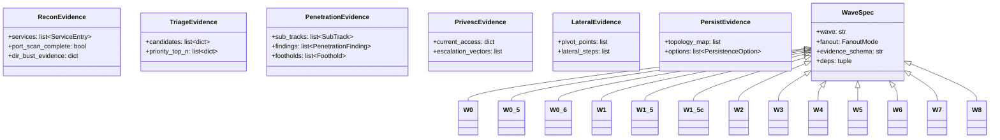
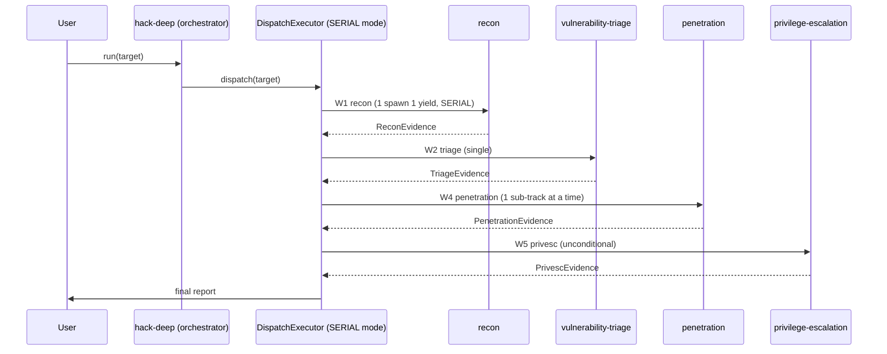
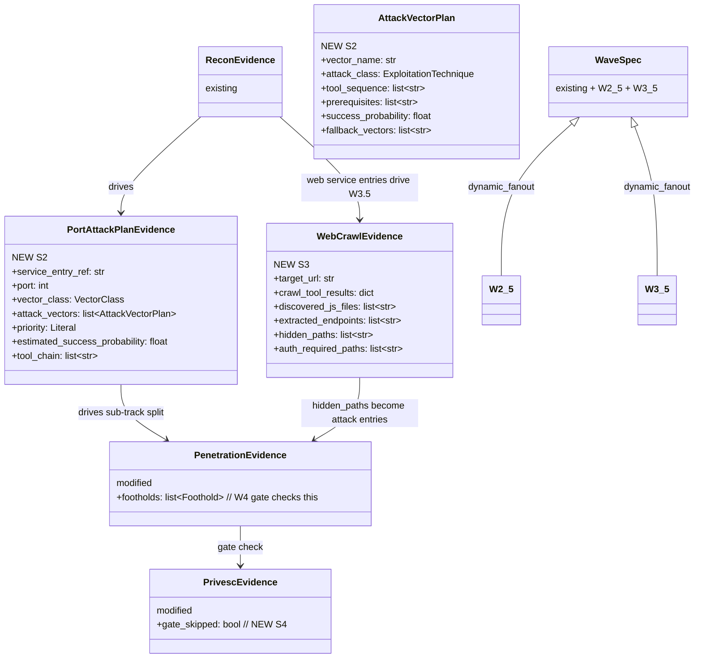
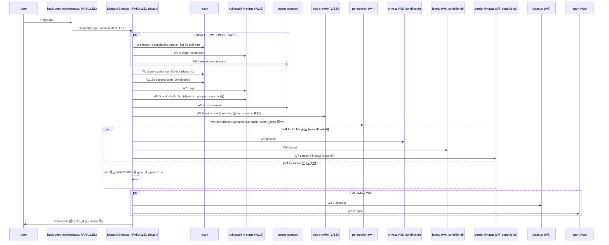

# Delivery Solution: hack-deep 流程重构（默认并行 + 端口攻击计划 + Web 爬虫 + 后渗透条件跳过）

## 0. Requirement Log
| Req ID | Captured At | Source | Description | Round | Status | Origin File |
| --- | --- | --- | --- | --- | --- | --- |
| R1 | 2026-06-11 | user: "你仔细梳理 hack-deep，结合我新给你的资料，重构他的流程。默认并行模式" | 把 hack-deep 默认模式从 v3.2 SERIAL 改回 PARALLEL,满足"最大限度的并发"要求 | 1 | in-progress | — |
| R2 | 2026-06-11 | user: "资产搜集阶段要做最全的资产收集，需要用到黑客工具" | W1 recon 调用全部 59 个 skill(R1+R3 落地集),而非当前 32 个 | 1 | in-progress | — |
| R3 | 2026-06-11 | user: "针对端口端口制定专业的攻击计划" | 新增 W2.5 端口攻击计划 wave,per-port + vector 拆(高复杂度) | 1 | in-progress | — |
| R4 | 2026-06-11 | user: "针对web类端口或者web要使用爬虫技术发现路径" | 新增 W3.5 Web 爬虫 wave,覆盖全部 ServiceEntry.service == "web" 端口,产出 CrawlEvidence (urls / js_files / hidden_paths) | 1 | in-progress | — |
| R5 | 2026-06-11 | user: "入侵成功后才进入后渗透阶段，如果没有，则直接进入报告阶段" | W4 无 owned/partial foothold 时,executor 跳过 W5/W6/W7 直接 W8 | 1 | in-progress | — |
| R6 | 2026-06-11 | user: "每个阶段都要做到最专业，最大限度的并发" | 所有 static_fanout / dynamic_fanout wave 真正并行,PARALLEL 默认,max fanout 调优 | 1 | in-progress | — |

## 0. Round Log
| Round | Theme | Captured At | Closed At | Validation | Worktree Δ | Status |
| --- | --- | --- | --- | --- | --- | --- |
| 1 | hack-deep 流程重构 (并行 + W2.5 + W3.5 + gate + max-concurrency) | 2026-06-11 | — | TBD | TBD | in-progress |

## 1. Metadata
| Field | Value |
| --- | --- |
| Topic | hack-deep 流程重构 (PARALLEL + W2.5 端口攻击计划 + W3.5 Web 爬虫 + 后渗透 gate) |
| Requirement Source Type | freeform (用户明确列出 6 个需求 + AskUserQuestion 拍板 4 个关键决策) |
| Source Inputs | 用户 2026-06-11 消息 (5 条要求) + AskUserQuestion 答复 (W2.5 高复杂度 / W3.5 全 web port / gate skip / PARALLEL 默认) |
| Scope Mode | named-subset (6 个明确需求 + 4 个拍板决策) |
| Active Req IDs | R1, R2, R3, R4, R5, R6 |
| Execution Status | confirmed (用户已说"开干,一步到位") |
| Last Updated | 2026-06-11 |

## 2. Goal
**重构 hack-deep 流程为"全并行 + 端口级攻击计划 + Web 路径爬取 + 后渗透条件触发"的专业渗透形态**:

- **R1 默认并行**: DispatchMode 默认从 SERIAL 改回 PARALLEL (override v3.2)
- **R2 最全资产**: W1 recon 调全部 59 个 skill (R1+R3 落地集),涵盖 5 P0 + 6 P1 + 8 R1 + 23 web attack + 9 subdomain enum
- **R3 W2.5 端口攻击计划**: per-port + vector 拆解,每个端口多个攻击向量,产出 PortAttackPlanEvidence,供 W4 拆 sub-track
- **R4 W3.5 Web 爬虫**: 全部 ServiceEntry.service == "web" 端口并行跑 katana + waybackurls + subjs + jsluice,产出 CrawlEvidence (urls / js_files / hidden_paths)
- **R5 后渗透 gate**: W4 无 owned/partial foothold → 跳 W5/W6/W7 → 直接 W8
- **R6 最大限度并发**: 所有 fanout wave 真正并行,PARALLEL 默认,bucket size 调优

明确**不做**:
- ❌ 不动 cyberstrike-deep (peer,保留)
- ❌ 不动 ROE 强制 (沿用 R3 决定)
- ❌ 不引入 nuclei (沿用 R1/R2 决定)
- ❌ 不重写 Typed Envelope 协议
- ❌ 不动 evidence schema 顶层结构 (只加字段 + 新 schema)

## 3. In Scope — 8 个 Solution Point

### 3.1 S1: DispatchMode 默认改 PARALLEL
- 改 [src/opensquilla/attack_dispatch/executor.py](src/opensquilla/attack_dispatch/executor.py):
  - `class DispatchExecutor.__init__` 的 `mode: DispatchMode = DispatchMode.PARALLEL` 默认值 (改自 v3.2 的 SERIAL)
  - 保留 SERIAL 作为 opt-in (operator 可显式指定)
- 改 [src/opensquilla/agents/hack-deep/SOUL.md](agents/hack-deep/SOUL.md) §"Serial Mode (v3.2) — 默认" → "Parallel Mode (v4.0, 2026-06-11) — 默认"
- 注释改: 同 wave 内 N 个 specialist 一次 assistant message 同时 spawn

### 3.2 S2: 新增 W2.5 端口攻击计划 wave
- 改 [src/opensquilla/attack_dispatch/waves.py](src/opensquilla/attack_dispatch/waves.py):
  - 新增 `"W2.5": _w("W2.5", LayerName.BREADTH.value, "vulnerability-triage", "port-attack-plan-v1", deps=("W2", "W1.5c"), fanout="dynamic_fanout")`
  - W2.5 fanout count = entry_count // 6 (更细,每个 sub-track 处理 ~6 个端口)
- 改 [src/opensquilla/attack_dispatch/evidence.py](src/opensquilla/attack_dispatch/evidence.py):
  - 新增 schema `PortAttackPlanEvidence` (port-attack-plan-v1):
    - `service_entry_ref: str` (引用 ReconEvidence.services 的 host:port)
    - `port: int`
    - `vector_class: VectorClass`
    - `attack_vectors: list[AttackVectorPlan]` (per-port + vector 拆,高复杂度)
    - `priority: Literal["P0","P1","P2","P3"]`
    - `estimated_success_probability: float` (0.0-1.0)
    - `estimated_runtime_s: int`
    - `tool_chain: list[str]` (建议的 tool 序列, e.g. ["naabu", "nmap -sV", "sqlmap"])
  - 新增 Pydantic 子模型 `AttackVectorPlan`:
    - `vector_name: str` (e.g. "ssh_weak_creds", "sql_injection", "rce_deserialization")
    - `attack_class: ExploitationTechnique` (复用 PenetrationFinding 的枚举)
    - `tool_sequence: list[str]`
    - `prerequisites: list[str]`
    - `success_probability: float`
    - `fallback_vectors: list[str]`
  - 注册到 EVIDENCE_SCHEMAS registry
- W2.5 触发条件: `ReconEvidence.services` 含至少 1 个 reachable service
- W2.5 fail-fast: 若 services 为空,跳过 W2.5 → 直接 W3

### 3.3 S3: 新增 W3.5 Web 爬虫 wave
- 改 [src/opensquilla/attack_dispatch/waves.py](src/opensquilla/attack_dispatch/waves.py):
  - 新增 `"W3.5": _w("W3.5", LayerName.BREADTH.value, "recon", "web-crawl-v1", deps=("W2.5",), fanout="dynamic_fanout")`
  - W3.5 fanout count = web_service_count // 4 (每个 sub-track 处理 ~4 个 web 端口)
  - 改 LAYERS[BREADTH] 加入 "W3.5"
- 改 [src/opensquilla/attack_dispatch/evidence.py](src/opensquilla/attack_dispatch/evidence.py):
  - 新增 schema `WebCrawlEvidence` (web-crawl-v1):
    - `target_url: str` (完整 URL,例如 https://target:443)
    - `crawl_tool_results: dict[str, list[str]]` (key=tool_name, value=discovered URLs/paths)
    - `discovered_js_files: list[str]`
    - `extracted_endpoints: list[str]` (从 JS / API 提取的 endpoint)
    - `hidden_paths: list[str]` (ffuf/waybackurls 字典爆破命中)
    - `auth_required_paths: list[str]` (需要登录的路径,留给 W4)
    - `total_urls: int`
    - `crawl_runtime_s: int`
  - 注册到 EVIDENCE_SCHEMAS registry
- W3.5 触发条件: ReconEvidence.services 含 vector_class=='web' 的服务
- W3.5 fail-fast: 无 web service,跳过 W3.5 → 直接 W4

### 3.4 S4: W4 → W5/W6/W7 gate 跳过逻辑
- 改 [src/opensquilla/attack_dispatch/executor.py](src/opensquilla/attack_dispatch/executor.py):
  - 新增 `_check_foothold_gate(wave_evidence: dict) -> bool`:
    - 读 `state.evidence["W4"]`
    - 若 `PenetrationEvidence.footholds` 为空 OR 全部 footholds 的 `persistence_level == "ephemeral"`
    - 返回 False → 标记 W5/W6/W7 为 "skipped"
  - 新增 `WaveResult.status: Literal["completed","partial","failed","skipped"]`
  - 在 `_run_wave` 末尾检查 gate,跳过 W5/W6/W7 时:
    - 不调 specialist
    - 写占位 evidence (PrivescEvidence / LateralEvidence / PersistEvidence with status=skipped)
    - WaveResult.status = "skipped"
    - state.errors 不增加 (不是错误,是有意跳过)
- 改 evidence.py: PrivescEvidence / LateralEvidence / PersistEvidence / ImpactEvidence 加 `gate_skipped: bool = False` 字段

### 3.5 S5: SOUL.md 重构
- 改 [~/.opensquilla/agents/hack-deep/SOUL.md](~/.opensquilla/agents/hack-deep/SOUL.md):
  - §"Serial Mode (v3.2) — 默认" → 替换为 §"Parallel Mode (v4.0, 2026-06-11) — 默认"
  - §"Attack Path — 4-Layer × 9-Wave DAG" → 升级为 §"Attack Path — 4-Layer × 11-Wave DAG (R1/W2.5/W3.5 added)"
  - 新增 §"W2.5 Port Attack Plan" 段: per-port + vector 拆,读 ReconEvidence.services 跑 dynamic_fanout
  - 新增 §"W3.5 Web Crawl" 段: 全 web service 并发爬虫,katana + waybackurls + subjs + jsluice
  - 新增 §"Post-Exploitation Gate" 段: W4 无 foothold → 跳 W5/W6/W7 → W8 cleanup+report

### 3.6 S6: tests 增量
- 改 [tests/test_attack_dispatch.py](tests/test_attack_dispatch.py):
  - `test_default_mode_is_parallel` (R1)
  - `test_w2_5_registered` (S2)
  - `test_w3_5_registered` (S3)
  - `test_post_exploit_gate_skip_when_no_foothold` (S4)
  - `test_post_exploit_gate_run_when_owned_foothold` (S4)
  - `test_port_attack_plan_schema` (S2)
  - `test_web_crawl_evidence_schema` (S3)
- 改 [tests/test_hack_deep_soul_contract.py](tests/test_hack_deep_soul_contract.py):
  - 加 SOUL content pin: "Parallel Mode (v4.0" 段存在
  - 加 "Post-Exploitation Gate" 段存在
- 更新 `TestWaves.test_<N>_waves` 断言: 总 wave 数从 13 → 15 (加 W2.5 + W3.5)

### 3.7 S7: docs 增量
- 改 [docs/hack-deep.md](docs/hack-deep.md):
  - §2 "4-Layer × 11-Wave DAG" → §2 "4-Layer × 15-Wave DAG (v4.0)"
  - 加 §2.1 "What's new in v4.0" 段: PARALLEL 默认 + W2.5 + W3.5 + gate
  - 加 §2.2 "Post-Exploitation Gate" 段

### 3.8 S8: README 增量
- 改 [README.md](README.md):
  - "Recon / Web coverage toolchain" 段加一行: "hack-deep v4.0: PARALLEL 默认 + W2.5 端口攻击计划 + W3.5 Web 爬虫 + 后渗透条件跳过"

## 4. Out of Scope
- ❌ 不动 cyberstrike-deep (peer, 保留)
- ❌ 不引入 ROE 强制
- ❌ 不引入 nuclei
- ❌ 不重写 Typed Envelope 协议 (envelope.py 不动)
- ❌ 不动 evidence.py 顶层结构 (只加字段 + 新 schema)
- ❌ 不重写 R1/R3 已落地的 add_*_skills.py (skill 注册不动)
- ❌ 不改 attack_dispatch 的 subagent_supervisor (保留 v3.1 设计)

## 5. Constraints And Principles
- 所有 evidence schema 改动必须后向兼容 (list 字段无 max_length, 新字段用 Optional 兜底)
- 所有 wave 注册必须不破坏 W0-W8 拓扑 (W2.5 插在 W2-W3 之间; W3.5 插在 W3-W4 之间)
- 单文件不超过 1000 行 (waves.py + evidence.py + executor.py 都会增长但不会超)
- 优先简单实现, 不引入新抽象层
- 严格 clean code: 可读命名 + 单一职责 + 显式 barrier
- PARALLEL 默认但保留 SERIAL opt-in (operator 可在 hack-deep SOUL 显式调 mode=SERIAL)
- W2.5 fanout bucket = 6 (R1/R3 的 8 减到 6,因为 per-port + vector 拆更耗)
- W3.5 fanout bucket = 4 (web 爬虫开销大,小 bucket 控成本)
- W4 bucket 仍 8 (不变)
- gate 跳过不写入 state.errors (是 conditional execution, 不是 error)
- W2.5 / W3.5 的 wave 名字保留 ".5" 后缀 (drill-in slot 命名空间)

## 6. Current Architecture (v3.2)

- **hack-deep agent**: 4 层 × 11 波编排者, 13 specialists, 默认 SERIAL 模式 (v3.2)
- **attack_dispatch 包**:
  - `envelope.py` — Typed Task Envelope + Result Marker 解析
  - `evidence.py` — 16 个 evidence schema (R1+R3 加 ResourceEvidence)
  - `waves.py` — 13 wave DAG 注册表 (W0..W8 + W0.5 + W0.6 + W1.5 + W1.5c)
  - `executor.py` — DispatchMode.PARALLEL 默认 / SERIAL opt-in
- **subagent_supervisor** — 60s cron watchdog
- **13 specialists** — recon / intel-collection / attack-surface-enumeration / vulnerability-triage / opsec-evasion / penetration / privilege-escalation / lateral-movement / persistence-maintenance / impact-exfiltration / cleanup-rollback / reporting-remediation / engagement-planning

## 7. Current Class Diagram (v3.2)

## 8. Current Sequence Diagram (v3.2)

## 9. Target Architecture (v4.0)

**关键变化**:
- 15 wave DAG (W0..W8 + W0.5 + W0.6 + W1.5 + W1.5c + W2.5 + W3.5)
- DispatchMode 默认 PARALLEL (override v3.2 SERIAL)
- W2.5 新增: per-port + vector 拆端口攻击计划
- W3.5 新增: 全 web port 并发爬虫
- W4 gate: 无 foothold 跳 W5/W6/W7 → 直接 W8

**不变**:
- 16 个 R1+R3 evidence schema 顶层结构 (只加 2 个新 schema: PortAttackPlanEvidence / WebCrawlEvidence)
- Typed Envelope / Result Marker / barrier / sessions_spawn 协议
- 13 个 specialist persona
- 59 个 skill (R1+R3 落地集)
- subagent_supervisor watchdog

## 10. Target Class Diagram

## 11. Target Sequence Diagram (v4.0)

## 12. Preconditions / Open Questions
- **全部 resolved** (用户已答 AskUserQuestion 4 题):
  - W2.5 结构: per-port + vector 拆 (高复杂度)
  - W3.5 范围: 全部 ServiceEntry.service == "web"
  - W4 gate: 无 owned/partial → 跳 W5/W6/W7 (直接 W8)
  - DispatchMode: PARALLEL 改默认

## 13. Solution Checklist
| ID | Req IDs | Solution Point | Why It Exists | Dependency | Acceptance Evidence | Status |
| --- | --- | --- | --- | --- | --- | --- |
| S1 | R1 R6 | DispatchMode.PARALLEL 默认 + SOUL.md 改"Parallel Mode v4.0" | 默认并行 + 最大限度并发 | 无 | test_default_mode_is_parallel + SOUL pin | pending |
| S2 | R3 | 新增 W2.5 wave + PortAttackPlanEvidence + AttackVectorPlan 子模型 | per-port + vector 拆攻击计划 | 无 | test_w2_5_registered + test_port_attack_plan_schema | pending |
| S3 | R4 | 新增 W3.5 wave + WebCrawlEvidence | 全 web service 并发爬虫 | S2 | test_w3_5_registered + test_web_crawl_evidence_schema | pending |
| S4 | R5 | W4 gate 跳过 W5/W6/W7 逻辑 + gate_skipped 字段 | 入侵失败直接进报告 | S2 S3 | test_post_exploit_gate_skip_when_no_foothold + test_post_exploit_gate_run_when_owned_foothold | pending |
| S5 | R1 R3 R4 R5 R6 | hack-deep SOUL.md 重构 (新 wave 段 + Parallel Mode + Gate) | SOUL 合约变更 | S1-S4 | SOUL content pin test | pending |
| S6 | R1 R3 R4 R5 R6 | tests 增量 (12 个新断言 + wave count 更新) | 防回归 | S1-S5 | pytest 全绿 | pending |
| S7 | R1 R3 R4 R5 R6 | docs/hack-deep.md §2 升级 + §2.1 v4.0 段 | 文档同步 | S1-S6 | grep 验证 | pending |
| S8 | R1 R3 R4 R5 R6 | README.md Key Features 加 hack-deep v4.0 行 | 文档可见 | S1-S7 | grep 验证 | pending |

## 14. Execution Notes

### Round 1 (Serial Foundation) — 4 个核心代码改动
- **T1**: S1 executor.py PARALLEL 默认
- **T2**: S2 evidence.py PortAttackPlanEvidence + waves.py W2.5 注册
- **T3**: S3 evidence.py WebCrawlEvidence + waves.py W3.5 注册
- **T4**: S4 executor.py gate 跳过逻辑 + evidence.py gate_skipped 字段
- **T5**: S5 hack-deep SOUL.md 重构 (4 个新段)
- 5 个 T 串行 (改 waves.py / evidence.py 顺序敏感)

### Round 2 (Parallel 3-Thread)
- **Thread A**: T6 tests/test_attack_dispatch.py + test_hack_deep_soul_contract.py 增量 12 断言
- **Thread B**: T7 docs/hack-deep.md §2 升级 + v4.0 段
- **Thread C**: T8 README.md Key Features 加 v4.0 行
- 3 线程并行 (无文件竞争)

### Round 3 (Merge Gate)
- 全量回归 + final-review → decision=close

### 风险点
- **R4-R1**: PARALLEL 默认可能导致 context window 溢出 (大目标) → 保留 SERIAL opt-in,operator 显式可选
- **R4-R2**: W2.5 per-port + vector 拆可能让 fanout 数暴涨 (100+ 端口目标 → 100+ sub-track) → bucket=6 限上限, 单 wave 上限 20 sub-track
- **R4-R3**: W3.5 web crawl 对 50+ web port 可能跑很久 → bucket=4 + timeout per sub-track 300s
- **R4-R4**: W4 gate 跳过 W5/W6/W7 时 specialist 可能不被调用, 但 LLM brief 已写 → brief 里加 `if gate_skip: return {"status":"skipped","reason":"no footholds"}` 兜底
- **R4-R5**: PortAttackPlanEvidence 的 success_probability 由 LLM 估,不准 → 只用于排序,不作为强制 gate
- **R4-R6**: WebCrawlEvidence 的 hidden_paths 数量大 (waybackurls 单域可 > 10k) → LLM 取前 100 + 关键词过滤

## 15. Termination Checklist
- [ ] R1-R6 全部 completed
- [ ] Round 1 5 个 T 状态 `completed`
- [ ] Round 2 3 线程状态 `completed`
- [ ] Round 3 全量回归全绿 (test_attack_dispatch + test_recon_coverage + test_hack_deep_soul_contract)
- [ ] waves.py 含 15 wave (W0-W8 + W0.5 + W0.6 + W1.5 + W1.5c + W2.5 + W3.5)
- [ ] evidence.py 含 18 schema (16 R1+R3 + 2 新: PortAttackPlanEvidence + WebCrawlEvidence)
- [ ] executor.py 默认 mode=PARALLEL
- [ ] hack-deep SOUL.md 含 Parallel Mode v4.0 + W2.5 + W3.5 + Post-Exploitation Gate 4 段
- [ ] docs/hack-deep.md §2 升级到 15 wave
- [ ] README.md Key Features 含 hack-deep v4.0 行
- [ ] 规范化 todo 全部 `completed`
- [ ] delivery-state.json current_status=complete + final_audit_status=passed