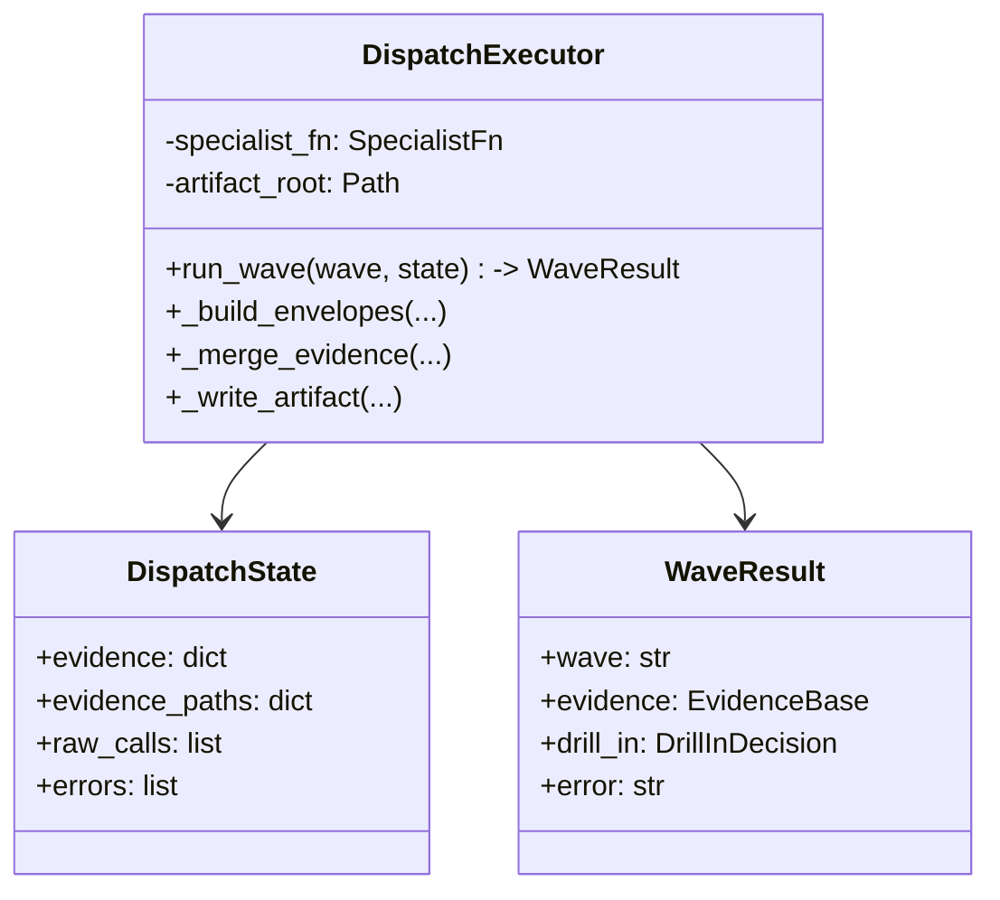
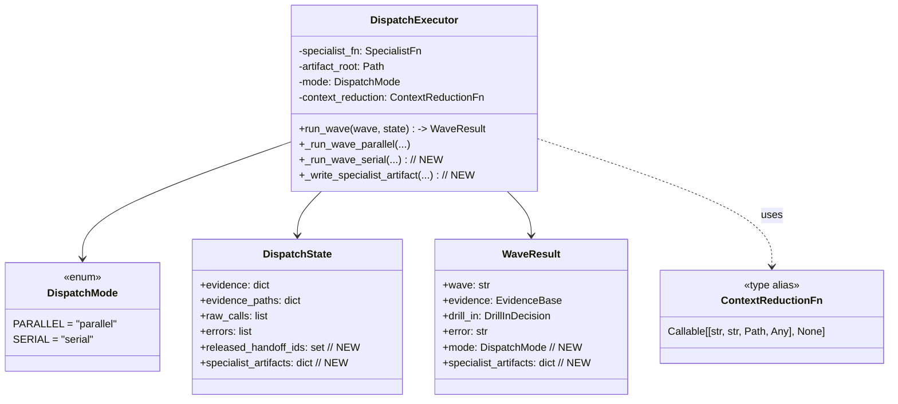

# Delivery Solution: hack-deep 串行模式重构 (v3.2, 2026-06-07)

## 1. Metadata
| Field | Value |
| --- | --- |
| Topic | hack-deep 串行模式重构 (v3.2) — Python 执行器 + SOUL 合约同时改 |
| Requirement Source Type | freeform (用户原话："hack-deep 整个过程，重构一下，新增一个串行，同一时间只执行一个子agent，这样节省上下文窗口大小。") |
| Source Inputs | 用户上一轮 12 项建议已全部完成；本轮用户决定不在 runtime 强制，靠 SOUL 合约引导 LLM |
| Scope Mode | named-subset (Python executor + SOUL 合约 + 文档/测试 协同) |
| Execution Status | confirmed (用户已确认"Python 执行器 + SOUL 合约"重构范围与"不动 runtime") |
| Last Updated | 2026-06-07 |

## 2. Goal
hack-deep 从"同 wave 内一次 assistant message 多 sessions_spawn (fan-out)"改为"一次 1 个 sessions_spawn + sessions_yield 等收口"——同一时间只有 1 个 specialist 在飞；每个 specialist 的 raw 在 executor 端立刻落盘到 per-specialist JSON，并通过 `context_reduction` 回调让 LLM 释放 raw。这样大目标 (50+ subdomains, 200+ services) 不会让 LLM 上下文窗口爆。

## 3. In Scope

- **S1** `src/opensquilla/attack_dispatch/executor.py` — 新增 `class DispatchMode(str, Enum)` (`PARALLEL` | `SERIAL`)
- **S2** `DispatchExecutor.__init__` 加 `mode: DispatchMode = PARALLEL` 与 `context_reduction: ContextReductionFn | None = None` 两个新参数
- **S3** `DispatchState` 加 `released_handoff_ids: set[str]` 与 `specialist_artifacts: dict[str, str]` 两个新字段
- **S4** `WaveResult` 加 `mode: DispatchMode` 与 `specialist_artifacts: dict[str, str]` 两个新字段
- **S5** `run_wave` 拆为 `_run_wave_parallel` (旧行为不变) + `_run_wave_serial` (新)
- **S6** `_run_wave_serial` 主循环内：调 specialist → 写 per-specialist JSON → 触发 context_reduction → 累积到 state.raw_calls
- **S7** `_write_specialist_artifact` 新 helper：写 per-specialist JSON，形状与合并文件对齐但 `specialist_calls=1`
- **S8** `_write_artifact` 接受可选 `per_specialist_artifacts` + `mode` 参数；SERIAL 模式下合并文件改名 `<wave>.combined.json` 避开 per-specialist handoff_id 冲突
- **S9** `_artifact_path_for` 增加对 W1.6a/b/c (不含 ".5" 子串) 的检测，路由到 `<wave>.drill_in/` 子目录
- **S10** `_run_drill_slot` 在 SERIAL 模式下也走 per-slot 落盘 + context_reduction
- **S11** `src/opensquilla/attack_dispatch/__init__.py` 导出 `DispatchMode`
- **S12** `scripts/clone_cyberstrike_to_hack_deep.py` 把 SOUL_BODY 的 "Parallel Logic" 段改为 "Serial Mode (v3.2)" 段
- **S13** ATTRIBUTION_BODY 的 modification log 末尾加 v3.2 标记
- **S14** `docs/hack-deep.md` 加 §5.5 "Serial Mode (v3.2)" 章节
- **S15** `tests/test_attack_dispatch.py` 加 `TestSerialMode` 类 (8 测试)
- **S16** `tests/test_hack_deep_soul_contract.py` 加 4 个 SOUL/ATTRIBUTION 断言
- **S17** `README.md` Key Features 表 hack-deep 行加 v3.2 serial 描述

## 4. Out of Scope

- ❌ 不修改 `src/opensquilla/tools/builtin/sessions.py` 的 `max_children_per_session=6` runtime 强制
- ❌ 不修改 `subagent_contract.py` 公开 API
- ❌ 不修改 `cyberstrike-deep` 配置
- ❌ 不修改 `envelope.py` 协议
- ❌ 不引入新第三方依赖

## 5. Constraints And Principles

- 向后兼容：`mode=DispatchMode.PARALLEL` (默认) 与 `context_reduction=None` (默认) 保留 v3.1 行为；既有 88 个测试不修改全过
- 既有约定：`extra=forbid` 的 EvidenceBase，新字段都用 Optional + 默认值
- 既有约定：artifact 路径命名 `<root>/<wave>/<handoff_id>.json`；drill-in 走 `<root>/<wave>.drill_in/` 子树
- 既有约定：per-wave 合并文件仍存在 (SERIAL 模式多一个 `per_specialist_artifacts` map + `mode` 字段)
- 单文件不超过 1000 行 (executor.py 当前 1100+，但单段函数拆分合理)
- 每个新模式加单测；既有 88 测试全过
- 简单实现，不引入新抽象层

## 6. Current Architecture

- `DispatchExecutor.run_wave` 同步循环：`for env in envelopes: specialist_fn(env, brief)`，单 wave 内顺序调用
- 真正并行在 LLM 层：SOUL.md 写明"同 wave 内:一次 assistant message 内多 sessions_spawn 调用(fan-out)"
- 每个 wave 末尾写一个合并 JSON (`<root>/<wave>/<primary_handoff_id>.json`)；per-sub raw 仅在内存 `state.raw_calls`
- 上下文窗口在 LLM 收口前必须持有所有 N 个 specialist 的 raw——大目标会爆

## 7. Current Class Diagram (执行器)



## 8. Current Sequence Diagram

```mermaid
sequenceDiagram
  participant LLM
  participant Ex as DispatchExecutor
  participant S as specialist

  LLM->>LLM: 一次发 N 个 sessions_spawn (W1: 3 个)
  par 3 个并行 specialist
    Ex->>S: spawn recon
    Ex->>S: spawn intel
    Ex->>S: spawn surface
  end
  LLM->>LLM: 等收口 (持有 3 个 raw 在 ctx)
  LLM->>Ex: run_wave 收口
  Ex->>Ex: 合并 evidence; 写 1 个合并 JSON
  LLM->>LLM: 下一 wave
```

## 9. Target Architecture

**关键变化**：
- executor 加 `mode=DispatchMode.SERIAL` 模式
- SERIAL 模式：每 specialist 跑完立即写 per-specialist JSON + 触发 context_reduction
- SOUL 合约改"1 个 spawn + 1 个 yield"
- Drill-in 槽也走 per-slot 落盘
- 向后兼容：默认 mode=PARALLEL 不变

**不变**：
- 13 specialist persona 不变
- 9 波 W0..W8 + W0.5 + W1.5 调度逻辑不变
- Typed Envelope / Result Marker / barrier / sessions_spawn 协议不变
- cyberstrike-deep 配置不动

## 10. Target Class Diagram



## 11. Target Sequence Diagram

```mermaid
sequenceDiagram
  participant LLM
  participant Ex as DispatchExecutor
  participant S as specialist
  participant FS as filesystem

  LLM->>LLM: 1 个 sessions_spawn (W1.recon.1)
  LLM->>Ex: specialist_fn
  Ex->>S: recon 跑完 → raw
  Ex->>FS: 写 W1.recon.1.json
  Ex->>LLM: context_reduction(W1, recon.1, path, raw)
  LLM->>LLM: 释放 raw, 只留 path + summary
  LLM->>LLM: sessions_yield 等收口
  LLM->>LLM: 下一 specialist (W1.intel-collection.2)
  ...
  LLM->>Ex: 收口
  Ex->>Ex: 合并 evidence; 写 W1.combined.json (含 per_specialist_artifacts map)
  LLM->>LLM: 下一 wave
```

## 12. Preconditions / Open Questions

- 全部 resolved。用户在两轮问答中明确：
  1. 重构范围 = Python executor + SOUL 合约 (推荐)
  2. runtime 强制 = 不动 (靠 SOUL 合约引导)

## 13. Solution Checklist

| ID | Solution Point | Why It Exists | Dependency | Acceptance Evidence | Status |
| --- | --- | --- | --- | --- | --- |
| S1 | executor.py: `class DispatchMode(str, Enum)` | 并发模式枚举 | 无 | `TestSerialMode::test_parallel_mode_default_unchanged` (mode=parallel 默认) | completed |
| S2 | executor.py: `__init__` 加 `mode` / `context_reduction` 参数 | 启用 SERIAL 模式 | S1 | 同 S1 | completed |
| S3 | executor.py: `DispatchState` 加 `released_handoff_ids` / `specialist_artifacts` | 跟踪已落盘 | S1 | `test_serial_mode_state_records_released_handoff_ids` | completed |
| S4 | executor.py: `WaveResult` 加 `mode` / `specialist_artifacts` | 结果可观测 | S1 | 既有 20 个 TestExecutor 测试 + 8 个 TestSerialMode | completed |
| S5 | executor.py: `run_wave` 拆为 `_run_wave_parallel` + `_run_wave_serial` | 双模式路由 | S1 | 既有测试不破 + 新 TestSerialMode | completed |
| S6 | executor.py: `_run_wave_serial` 主循环 per-specialist 落盘 | 核心实现 | S1-S5 | `test_serial_mode_persists_per_specialist_artifact` 等 7 个 | completed |
| S7 | executor.py: `_write_specialist_artifact` helper | 写 per-specialist JSON | S5 S6 | 同 S6 | completed |
| S8 | executor.py: `_write_artifact` 加 `per_specialist_artifacts` / `mode` 参数 | 合并文件含 per-specialist map | S1 S5 | `test_serial_mode_combined_artifact_references_per_specialist` | completed |
| S9 | executor.py: `_artifact_path_for` 加 drill-in slot 名检测 | 路由 W1.6a/b/c 到 drill_in 子树 | S5 | `test_serial_mode_drill_in_persists_per_slot_artifact` | completed |
| S10 | executor.py: `_run_drill_slot` SERIAL 模式 per-slot 落盘 | drill-in 也走 serial | S1 S5 | 同 S9 | completed |
| S11 | __init__.py 导出 `DispatchMode` | 公开 API | S1 | import 测试 | completed |
| S12 | clone_*.py: SOUL_BODY 改 "Serial Mode (v3.2)" 段 | LLM 合约 | S1 | `test_soul_documents_serial_mode_section` | completed |
| S13 | clone_*.py: ATTRIBUTION_BODY 加 v3.2 modification log | 文档溯源 | S12 | `test_attribution_documents_serial_mode_modification` | completed |
| S14 | docs/hack-deep.md 加 §5.5 | 顶层文档 | S12 | 文件存在 + 含 Serial Mode 章节 | completed |
| S15 | tests/test_attack_dispatch.py 加 TestSerialMode (8 测试) | 单元测试 | S1-S10 | `pytest tests/test_attack_dispatch.py::TestSerialMode -v` 全绿 | completed |
| S16 | tests/test_hack_deep_soul_contract.py 加 4 个 SOUL/ATTRIBUTION 断言 | 合约测试 | S12 S13 | `pytest tests/test_hack_deep_soul_contract.py -v` 全绿 (67/67) | completed |
| S17 | README.md Key Features 表 hack-deep 行加 v3.2 描述 | 文档入口 | S14 | grep README.md "v3.2" | completed |

## 14. Execution Notes

### Round 1 (串行地基, T1-T4)
executor.py + __init__.py 串行改；既有 88 测试保持全过；每个 T 完成立即跑 `pytest tests/test_attack_dispatch.py -v` 确认不破。

### Round 2 (3 线程并行)
- **Thread A (tests)**: TestSerialMode 8 测试
- **Thread B (合约)**: SOUL_BODY + ATTRIBUTION_BODY 改
- **Thread C (文档)**: docs/hack-deep.md + README.md + soul contract test + delivery doc

三线程无文件竞争：tests 只读 + 写新测试方法；clone 脚本只动 SOUL_BODY/ATTRIBUTION_BODY 字符串；docs/README 互不干扰。

### 合闸 (Round 3)
- T12: `pytest tests/test_attack_dispatch.py -v` → 96/96 全绿
- T13: `pytest tests/test_hack_deep_*.py -v` → 67/67 (soul) + 既有 18 (clone/spawn) 全绿
- T14: 跑 `python scripts/clone_cyberstrike_to_hack_deep.py` 把新 SOUL/ATTRIBUTION 落盘；grep 验证
- T15: 手工核查清单全过 → decision=close

### 风险点
- **R1**: per-specialist JSON 落盘失败 → 既有 `try/except OSError` 模式，state.errors 记一条
- **R2**: LLM 不遵守 SOUL 合约照常发 3 个 spawn → 用户选择"不动 runtime"；SOUL 表述明确 + 文档降低违反概率
- **R3**: drill-in 路由 (W1.6a/b/c 不含 ".5") → 已修复 `_artifact_path_for` 用 DRILL_IN_SLOTS 检测
- **R4**: per-specialist 与合并文件 handoff_id 冲突 → SERIAL 模式合并文件改名 `<wave>.combined.json`
