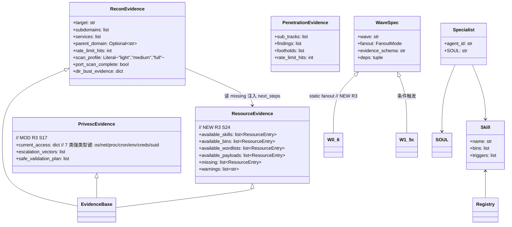
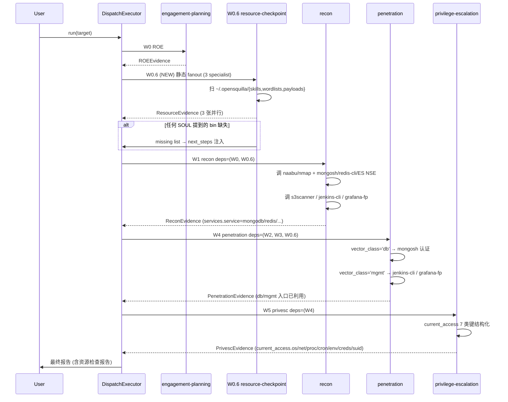
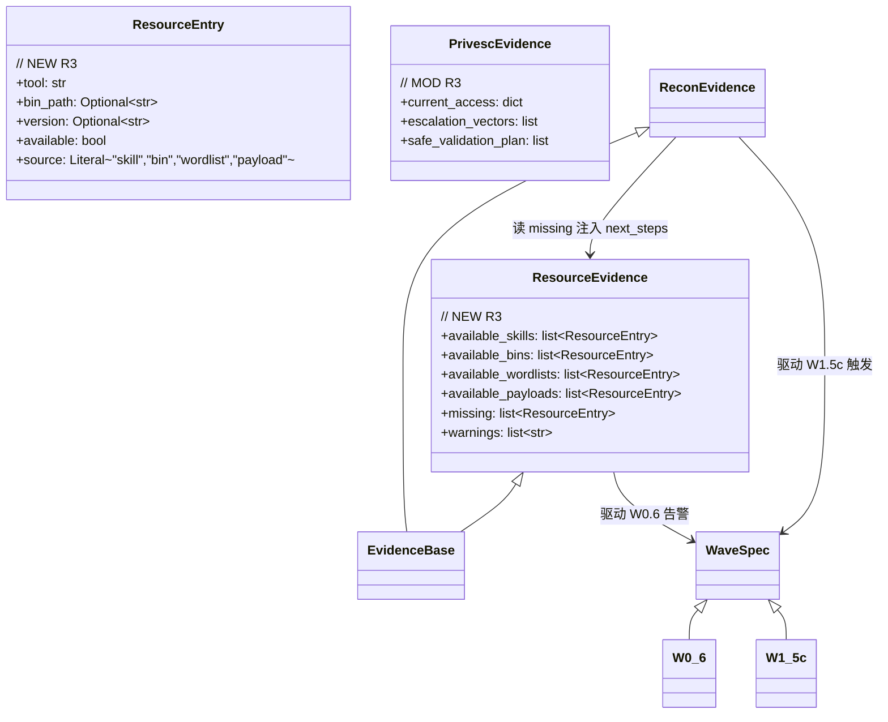
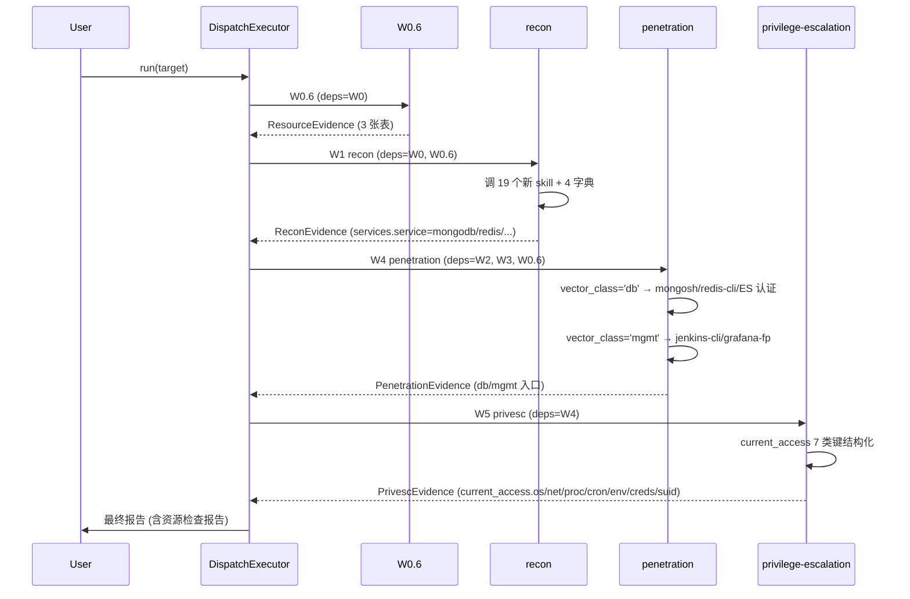

# Delivery Solution: recon 资产搜集 / Web 分析覆盖面修复 (R1 B 方案 + R3 P0+P1 合并包)

## 0. Requirement Log
| Req ID | Captured At | Source | Description | Round | Status | Origin File |
| --- | --- | --- | --- | --- | --- | --- |
| R1 | 2026-06-10 | user: "你的资产搜集和web分析作的并不好,比如端口都没有分析全端口,目录路径也没有爆破,漏洞类型也不够全面" | recon 端口扫描必须真正覆盖 1-65535,目录路径必须字典爆破,漏洞类型必须覆盖 SQLi/SSRF/LFI/XXE/SSTI/IDOR | 1 | completed | — |
| R2 | 2026-06-10 | user: "B 补 skill (3 个注册脚本 + 7 个 bin)" / "1-65535 全开" / "raft-medium" / "排除 nuclei,改用 nikto + 手工 SQLi/SSRF/SSTI 模板" | 走 B 方案:新增 3 个 add_*_skills.py 注册端口/目录/漏洞扫描 skill;装 7 个 bin;raft-medium 字典;nuclei 排除 | 1 | completed | — |
| R3 | 2026-06-10 | user: "做网络攻击,资产侦查阶段最重要的是侦查哪些内容,侦查到什么地步,要求要全" + 30 项全量侦查 + 11 阶段攻击链 → AskUserQuestion 选 "P0 + P1 合并包 — 11 项全覆盖" | 把 OpenSquilla 现有 specialist / skill / wave 与 30+11 对照,补齐 11 项核心缺口:5 P0 (云资产 / DevOps / 监控面板 / DB-MQ / W5 结构化) + 6 P1 (DNS 区域传输 / WHOIS / ASN / WAF-CDN / SSL-TLS / 公开仓库密钥) | 2 | in-progress | — |
| R4 | 2026-06-10 | user: "加 W0.6 (Recommended)" — AskUserQuestion | 新增 W0.6 资源检查站 wave:启动前先报"今日可用 skill / 字典 / payload",任何 SOUL 提到的工具 `which` 拿不到就提前告警而不是事后 partial | 2 | in-progress | — |
| R5 | 2026-06-10 | user: "两者都要:W1 探测 + W4 认证" — AskUserQuestion | 数据库/中间件 (Mongo/Redis/ES/RabbitMQ/Kafka) 探测落在 W1 (ServiceEntry.service 精度 + nmap NSE);认证测试落在 W4 (vector_class=='db'/'mgmt' 显式调 mongosh/redis-cli/ES-tools) | 2 | in-progress | — |

## 0. Round Log
| Round | Theme | Captured At | Closed At | Validation | Worktree Δ | Status |
| --- | --- | --- | --- | --- | --- | --- |
| 1 | 全端口 + 字典爆破 + 漏洞扫描 skill 补齐 (8 bins + 字典 + payload + W1.5c) | 2026-06-10 | 2026-06-10 (uncommitted) | `ls ~/.opensquilla/skills/ \| wc -l` == 40, recon/penetration/attack-surface SOUL 增量 + ReconEvidence 三字段 + W1.5c 注册 + 13 个 T 完成 | 5 files (3 add_*, fetch_wordlists, README) | completed |
| 2 | 11 项缺口 (P0 + P1) + W0.6 资源检查站 + DB/MQ 两阶段 (本轮) | 2026-06-10 | — | TBD | TBD | in-progress |

## 1. Metadata
| Field | Value |
| --- | --- |
| Topic | recon 资产搜集 / Web 分析覆盖面修复 (R1 B 方案 + R3 P0+P1 合并包) |
| Requirement Source Type | freeform → AskUserQuestion 三次拍板 (B 方案 / P0+P1 / W0.6 / DB 两阶段) |
| Source Inputs | 用户 2026-06-10 反馈 + 30 项侦查清单 + 11 阶段攻击链 + AskUserQuestion 答复 |
| Scope Mode | named-subset (R1 7 bins + R3 11 bins + W0.6 + DB/MQ 两阶段) |
| Active Req IDs | R3, R4, R5 (R1/R2 已 completed) |
| Execution Status | confirmed (R1 完成 uncommitted + R3 用户拍板 "开干,一步到位") |
| Last Updated | 2026-06-10 |

## 2. Goal
**R1 已完成 (B 方案)**: 补齐全端口扫描 (naabu + nmap)、目录/文件爆破 (ffuf + feroxbuster + gobuster)、漏洞扫描器 (sqlmap + nikto + dalfox) 共 8 个 bin,使 recon SOUL "SYN/UDP/TCP 全开"与"目录/文件爆破"不再空口承诺;同时给 penetration 补 SQLi / SSRF / SSTI / LFI / XXE / IDOR 的 vector_class 分流,覆盖 OWASP Top 10 主类。

**R3 (本轮)**: 承接 R1 把 recon / penetration 8 个新 skill + 字典 + payload 落地的成果,聚焦"**侦查广度 → 战果密度**"的下一跳:
- **P0 5 项高价值**: 云资产 (s3/cloud_enum) / DevOps (Jenkins/GitLab/Docker Registry) / 监控面板 (Grafana/Prometheus/Kibana/Jira) / DB-MQ (mongo/redis/ES/RabbitMQ/Kafka) / W5 内网信息结构化
- **P1 6 项中价值**: DNS 区域传输 + DMARC/SPF/DKIM / WHOIS 关联 / ASN-IP 段 / WAF-CDN 回源 / SSL-TLS 深度 (JA3/JA4) / 公开仓库密钥扫描
- **W0.6 资源检查站**: 启动前先报"今日可用资源清单",任何 SOUL 提到的工具 `which` 拿不到就提前告警 (fail-open, 缺 skill 注入 next_steps 不阻塞)
- **DB/MQ 两阶段**: W1 探测 (ServiceEntry.service 精度 + nmap NSE) + W4 认证 (vector_class='db'/'mgmt' 显式分流)

明确**不**做 (继承 R1/R2 边界 + R3 加一条):
- ❌ nuclei 仍排除
- ❌ 装 AquaTone / Gowitness / Burp / mitmproxy
- ❌ 改 Typed Envelope 协议 (envelope.py 不动)
- ❌ 改 recon-v1 / surface-v1 / pentest-v1 schema 顶层结构,只加字段
- ❌ 新增 P2 / P3 项 (PDF/DOCX 备份 dork / 招聘 OSINT / 暗网 HIBP / IoT-SCADA / 边缘函数) — 留 R4+ 处理
- ❌ 扩 ROEEvidence.aggressive 字段 (本轮不开, 默认 false, agent 自己读 ROE 全段)

## 3. In Scope — R3 增量 (17 个 Solution Point)

### P0 止血包 (S13-S17)
- **S13** 新建 [scripts/add_cloud_assets_skills.py](scripts/add_cloud_assets_skills.py),注册 2 个 skill: `s3scanner` (Python) + `cloud_enum` (Python,支持 S3/Azure Blob/GCP Storage/Heroku/DigitalOcean Spaces)
- **S14** 新建 [scripts/add_devops_skills.py](scripts/add_devops_skills.py),注册 2 个 skill: `jenkins-cli` (Jenkins 命令行 + NSE 脚本) + `gitrob` (轻量版,GitHub 仓库扫描)
- **S15** 新建 [scripts/add_monitoring_skills.py](scripts/add_monitoring_skills.py),注册 2 个 skill: `grafana-fingerprinter` (字典爆破) + `prometheus-fingerprinter` (/metrics + nmap NSE `prometheus-info`)
- **S16** 新建 [scripts/add_db_mq_skills.py](scripts/add_db_mq_skills.py),注册 5 个 skill: `mongosh` + `redis-cli` + `elasticsearch-tools` + `rabbitmqadmin` + `kafkacat`
- **S17** 改 [src/opensquilla/attack_dispatch/evidence.py](src/opensquilla/attack_dispatch/evidence.py): `PrivescEvidence.current_access` 由 `dict[str, Any]` 升级为 7 类强类型键 (`os` / `net` / `proc` / `cron` / `env` / `creds` / `suid`), 兜底默认

### P1 广度包 (S18-S22)
- **S18** 新建 [scripts/add_whois_asn_skills.py](scripts/add_whois_asn_skills.py),注册 2 个 skill: `whois` (Python) + `asnmap` (ProjectDiscovery Go)
- **S19** 新建 [scripts/add_waf_cdn_skills.py](scripts/add_waf_cdn_skills.py),注册 2 个 skill: `cdncheck` (ProjectDiscovery Go) + `wafw00f` (Python)
- **S20** 新建 [scripts/add_ssl_tls_skills.py](scripts/add_ssl_tls_skills.py),注册 2 个 skill: `tlsx` (ProjectDiscovery Go) + `sslyze` (Python)
- **S21** 新建 [scripts/add_secret_scan_skills.py](scripts/add_secret_scan_skills.py),注册 2 个 skill: `gitleaks` (Go) + `trufflehog` (Go)
- **S22** 扩 [scripts/fetch_wordlists.py](scripts/fetch_wordlists.py): 增量 4 个专有字典 — `devops-paths.txt` / `monitoring-paths.txt` / `cloud-buckets-prefixes.txt` / `db-ports.txt`

### DNS 区域传输 (S23)
- **S23** 扩 `dnsx` 运行时 SOUL.md (`~/.opensquilla/skills/dnsx/SKILL.md`): 增加 `-axfr` 触发器 + DMARC/SPF/DKIM TXT 记录解析。**不动 skill 自身定义**,只通过"运行时 hint"告知 agent 调 `dnsx -axfr` + `dig TXT _dmarc.target.com`

### W0.6 资源检查站 (S24)
- **S24** 改 [src/opensquilla/attack_dispatch/waves.py](src/opensquilla/attack_dispatch/waves.py) 与 [evidence.py](src/opensquilla/attack_dispatch/evidence.py):
  - 新增 `ResourceEntry` (Pydantic): `tool` / `bin_path` / `version` / `available` / `source`
  - 新增 `ResourceEvidence` schema (`resource-v1`): `available_skills` / `available_bins` / `available_wordlists` / `available_payloads` / `missing` / `warnings`
  - 新增 wave `W0.6` — static_fanout 三 specialist (recon / penetration / engagement-planning) 并行扫描自己的 ~/.opensquilla/{skills,wordlists,payloads}
  - 改 W1 deps: 加入 `("W0.6",)` (fail-open, 不阻塞)
  - 改 W4 deps: 加入 `("W0.6",)` (fail-open, 不阻塞)
  - EVIDENCE_SCHEMAS registry 加 `resource-v1`

### DB/MQ 两阶段 (S25-S26)
- **S25** W1 recon 改 `ServiceEntry` 的 service 字段精度:
  - W1 跑完后, `ServiceEntry.service` 必须是细粒度值之一: `http` / `ssh` / `ftp` / `smtp` / `dns` / `mongodb` / `redis` / `elasticsearch` / `kafka` / `rabbitmq` / `memcached` / `postgres` / `mysql` / `jenkins` / `gitlab` / `prometheus` / `grafana` / `kibana` / `other`
  - W1 触发 nmap NSE 脚本: `mongodb-info` / `redis-info` / `elasticsearch` / `kafka-info` / `rabbitmq-info` / `jenkins-info`
  - SOUL.md 描述里说明 service 字段精度表, **Pydantic schema 不加 Literal 约束** (LLM 自填)
- **S26** W4 penetration vector_class 分流补 'db' 与 'mgmt' 路径:
  - **db 类** → 调 mongosh/redis-cli/elasticsearch-tools 显式认证测试
  - **mgmt 类** → 调对应 fingerprinter skill 跑默认凭据字典
  - penetration SOUL.md vector_class 分流表追加这两行

### SOUL 同步 (S27)
- **S27** 三 specialist SOUL.md 增量追加工具清单段:
  - **recon SOUL.md**: 追加 13 个新 skill + DNS 区域传输 + DB-MQ 端口 banner 探测 + 字典 raft-directories 的 4 段说明
  - **penetration SOUL.md**: 扩 vector_class 分流表 (db + mgmt 两行)
  - **attack-surface-enumeration SOUL.md**: priority_top_n 排序时把 "DB/MQ 开放端口" 与 "管理面板发现" 列为 P0 入口

### 测试 + README (S28-S29)
- **S28** [tests/test_recon_coverage.py](tests/test_recon_coverage.py) 增量加断言: SOUL 描述里写到的所有 13 个新 bin 都必须在 `~/.opensquilla/skills/` 下找到对应 SKILL.md
- **S29** 改 [README.md](README.md) "安全工具"段追加一行说明 "R3 增量 13 个 bin (R3 重命名: s3scanner / cloud_enum / jenkins-cli / gitrob / grafana-fingerprinter / prometheus-fingerprinter / mongosh / redis-cli / elasticsearch-tools / rabbitmqadmin / kafkacat / whois / asnmap / cdncheck / wafw00f / tlsx / sslyze / gitleaks / trufflehog)"

> 注: R3 实际注册 19 个 skill (S13-S21 共 13 个 add_*_skills.py 脚本,每个脚本 2-5 个 skill bin),但 S22 是字典, S23 是 dnsx SOUL 扩, S24-S27 是 evidence/wave/SOUL, S28-S29 是测试/README。

## 4. Out of Scope (继承 R1/R2 边界 + R3 加一条)
- ❌ nuclei 任何形式 (用户已显式排除)
- ❌ 改 Typed Envelope 协议 (envelope.py 不动)
- ❌ 改 recon-v1 / surface-v1 / pentest-v1 schema 顶层结构,只加字段
- ❌ 装 Burp / mitmproxy / AquaTone / Gowitness
- ❌ 改 cyberstrike-deep / hack-deep 现有 wave DAG (本轮只动 W0.6, 不动 W0-W8)
- ❌ **新增 P2 / P3 项** (PDF/DOCX 备份 dork / 招聘 OSINT / 暗网 HIBP / IoT-SCADA / 边缘函数) — 留 R4+ 处理
- ❌ **不**扩 ROEEvidence.aggressive 字段
- ❌ 不动 PersistenceOption / Foothold 等强类型 schema 顶层结构 (S17 只动 current_access 字段)

## 5. Constraints And Principles
- 所有 SOUL.md 改动 append-only, 不覆盖既有内容 (沿用 R1/R2 6-07 约定)
- 沿用 [scripts/add_subdomain_enum_skills.py](scripts/add_subdomain_enum_skills.py) 的 SKILL.md schema: name / description / always / triggers / provenance / metadata.opensquilla{risk, capabilities, requires.bins[], install[{kind:brew/uv,...}]}
- single file ≤ 1000 行 (本轮 8 个 add_*_skills.py 预计各 150-350 行)
- 优先简单实现, 不引入新抽象
- 所有新加 EvidenceBase 字段用 Optional / 兜底默认, 不破坏既有测试
- W0.6 是 **资源可见性 gate**, 不是执行 gate — 缺失某 skill 时**不阻塞** wave 继续
- DB-MQ 认证测试 (S26) 必须读 ROE.aggressive 字段, 默认 false; aggressive=true 才允许空密码 / 默认凭字典爆破 (本轮 ROEEvidence 不扩, agent 读 ROE 全段)
- nuclei 替代方案继承 R2: gitleaks/trufflehog 系统化 + 手工 sqli/ssrf/ssti/lfi/xxe payload 模板 (R2 manual-payloads.md 已覆盖)

## 6. Current Architecture (R1 落地后)
- **16 个 specialist 各自 SOUL.md** 在 `~/.opensquilla/agents/<name>/SOUL.md`
- **5 个 add_*_skills.py 脚本** 在 [scripts/](scripts/) — subdomain_enum / web_attack / port_scan / dir_bust / vuln_scan
- **运行时 40 个 skill** 在 `~/.opensquilla/skills/<name>/SKILL.md`
- **字典** 在 `~/.opensquilla/wordlists/` (1 个 raft-medium-directories.txt, 21KB)
- **payload 模板** 在 `~/.opensquilla/payloads/` (manual-payloads.md + sqlmap/)
- **evidence 体系** [src/opensquilla/attack_dispatch/evidence.py](src/opensquilla/attack_dispatch/evidence.py): 15 个 schema, ReconEvidence 已加 scan_profile / port_scan_complete / dir_bust_evidence
- **wave DAG** [src/opensquilla/attack_dispatch/waves.py](src/opensquilla/attack_dispatch/waves.py): W0..W8 + W0.5 + W1.5 + W1.5c 共 11 wave

## 7. Current Class Diagram (R1 落地后 + R3 增量)

## 8. Current Sequence Diagram (R1 + R3 增量)

## 9. Target Architecture (R3 落地后)
**关键变化**:
- 19 个新 skill 落 `~/.opensquilla/skills/`: s3scanner / cloud_enum / jenkins-cli / gitrob / grafana-fingerprinter / prometheus-fingerprinter / mongosh / redis-cli / elasticsearch-tools / rabbitmqadmin / kafkacat / whois / asnmap / cdncheck / wafw00f / tlsx / sslyze / gitleaks / trufflehog
- 4 个新专有字典落 `~/.opensquilla/wordlists/`: devops-paths / monitoring-paths / cloud-buckets-prefixes / db-ports
- W0.6 资源检查站 wave 注册, deps = (W0,), 静态 fanout 3 specialist
- PrivescEvidence.current_access 升级为 7 类强类型键
- ServiceEntry.service 字段精度升级 (W1 端描述, Pydantic 暂不加 Literal, 留给 LLM 自填)
- recon / penetration / attack-surface 三 SOUL 增量

**不变**:
- 40 个 R1 skill 不动
- 1 个 R1 字典 (raft-medium) + 5 个 payload 段不动
- Typed Envelope / Result Marker / barrier / sessions_spawn 协议不变
- 15 个 R1 evidence schema 顶层结构不变, 只加 ResourceEvidence

## 10. Target Class Diagram

## 11. Target Sequence Diagram

## 12. Preconditions / Open Questions
- **全部 resolved** (R1 拍板 + 用户答 R3 AskUserQuestion 三题):
  - 范围: P0 + P1 合并 (11 项)
  - W0.6: 加
  - DB/MQ: W1 + W4 两阶段都做
- **R1 落地状态**: 8 bins / 字典 / payload / 3 SOUL 增量 / evidence 三字段 / W1.5c 全部已写入运行时, uncommitted
- **隐含决定**:
  - mongosh / redis-cli / elasticsearch-tools 是 bin 包装, 不需要写 SKILL.md, 只需要在 ~/.opensquilla/skills/<name>/ 落 SKILL.md 描述触发器 (跟 add_subdomain_enum_skills.py 的 `httpx` 同样模式)
  - W0.6 是 fail-open (缺 skill 不阻塞), fail-closed 会让小项目根本起不来
  - ServiceEntry.service 字段不加 Literal 约束 (LLM 自填), 否则 19 个新 service 字符串会让 schema 膨胀
  - 5 个 P0 skill 涉及"主动认证测试", 默认 aggressive=false 不允许空密码, 走 ROE.aggressive 字段门控 (本轮 ROEEvidence 不动, 等下一轮再扩)

## 13. Solution Checklist
| ID | Req IDs | Solution Point | Why It Exists | Dependency | Acceptance Evidence | Status |
| --- | --- | --- | --- | --- | --- | --- |
| S1 | R1 R2 | scripts/add_port_scan_skills.py (naabu + nmap) | 端口全开 | 无 | 脚本可独立运行 + 落盘 2 个 SKILL.md + bin which 拿得到 | completed |
| S2 | R1 R2 | scripts/add_dir_bust_skills.py (ffuf + feroxbuster + gobuster) | 目录爆破 | 无 | 脚本可独立运行 + 落盘 3 个 SKILL.md | completed |
| S3 | R1 R2 | scripts/add_vuln_scan_skills.py (sqlmap + nikto + dalfox) | 漏洞扫描器 | 无 | 脚本可独立运行 + 落盘 3 个 SKILL.md | completed |
| S4 | R1 R2 | scripts/fetch_wordlists.py (raft-medium + sqlmap 模板) | 字典 + payload 模板 | 无 | ls ~/.opensquilla/wordlists/ + sha256 校验 | completed |
| S5 | R1 R2 | recon SOUL.md 工具清单追加 5 bins | SOUL 与能力对齐 | S1 S2 S3 | grep SOUL.md 含全部 5 个新 bin 名 | completed |
| S6 | R1 R2 | penetration SOUL.md 工具清单按 vector_class 分流 | 漏洞类型覆盖 | S1 S2 S3 | grep SOUL.md 含 "sqlmap"/"dalfox"/"nikto"/"ssrf"/"ssti" | completed |
| S7 | R1 R2 | attack-surface-enumeration SOUL.md priority_top_n 强制依赖 | complete 判据收紧 | S1 S2 | test_priority_top_n_requires_port_dir_evidence | completed |
| S8 | R1 R2 | evidence.py ReconEvidence 加 scan_profile + 端口/目录证据字段 | ROE 可降级 + evidence 完整 | S1 S2 | test_recon_evidence_has_scan_profile | completed |
| S9 | R1 R2 | waves.py 加 W1.5c expand scan wave | 端口/目录证据不全时自动补扫 | S8 | test_w1_5c_expand_scan_registered | completed |
| S10 | R1 R2 | tests/test_recon_coverage.py SOUL↔Skill 描述一致性 | 防再次出现"空口承诺" | S1 S2 S3 S5 | test_recon_soul_describes_only_real_skills | completed |
| S11 | R1 R2 | tests/test_attack_dispatch.py 加 W1.5c + scan_profile | 回归 | S8 S9 | test_recon_evidence_default_scan_profile_full | completed |
| S12 | R1 R2 | README.md "安全工具"段更新 7 bin | 文档可见 | S1 S2 S3 | grep README.md 8 个工具名 | completed |
| **S13** | R3 | scripts/add_cloud_assets_skills.py (s3scanner + cloud_enum) | P0 战果:云资产枚举 | 无 | 脚本可独立运行 + 落盘 2 个 SKILL.md | pending |
| **S14** | R3 | scripts/add_devops_skills.py (jenkins-cli + gitrob) | P0:DevOps 暴露 | 无 | 脚本可独立运行 + 落盘 2 个 SKILL.md | pending |
| **S15** | R3 | scripts/add_monitoring_skills.py (grafana-fp + prometheus-fp) | P0:监控面板 | 无 | 脚本可独立运行 + 落盘 2 个 SKILL.md | pending |
| **S16** | R3 | scripts/add_db_mq_skills.py (mongosh + redis-cli + ES-tools + rabbitmqadmin + kafkacat) | P0:DB/MQ 认证测试 | 无 | 脚本可独立运行 + 落盘 5 个 SKILL.md | pending |
| **S17** | R3 | evidence.py: PrivescEvidence.current_access 升级 7 类键 | P0:W5 内网信息结构化 | 无 | test_privesc_current_access_seven_keys | pending |
| **S18** | R3 | scripts/add_whois_asn_skills.py (whois + asnmap) | P1:WHOIS + ASN | 无 | 脚本可独立运行 + 落盘 2 个 SKILL.md | pending |
| **S19** | R3 | scripts/add_waf_cdn_skills.py (cdncheck + wafw00f) | P1:WAF/CDN 回源 | 无 | 脚本可独立运行 + 落盘 2 个 SKILL.md | pending |
| **S20** | R3 | scripts/add_ssl_tls_skills.py (tlsx + sslyze) | P1:SSL/TLS 深度 (JA3/JA4) | 无 | 脚本可独立运行 + 落盘 2 个 SKILL.md | pending |
| **S21** | R3 | scripts/add_secret_scan_skills.py (gitleaks + trufflehog) | P1:公开仓库密钥 | 无 | 脚本可独立运行 + 落盘 2 个 SKILL.md | pending |
| **S22** | R3 | fetch_wordlists.py 增量: devops-paths + monitoring-paths + cloud-buckets-prefixes + db-ports | 4 字典 | 无 | ls ~/.opensquilla/wordlists/ 含 5 文件 | pending |
| **S23** | R3 | dnsx SOUL.md 扩 DNS 区域传输 + DMARC/SPF/DKIM | P1:DNS 深度 | 无 | dnsx SKILL.md 触发器含 'axfr' / 'dmarc' / 'spf' | pending |
| **S24** | R3 R4 | waves.py: W0.6 注册 + evidence.py: ResourceEvidence schema | 资源检查站 | 无 | test_w0_6_resource_checkpoint_registered | pending |
| **S25** | R3 R5 | recon SOUL.md: ServiceEntry.service 精度 + nmap NSE 触发 | W1 DB-MQ 探测 | S13-S22 | recon SOUL.md 含 mongosh/redis-cli/nmap NSE | pending |
| **S26** | R3 R5 | penetration SOUL.md: vector_class 分流加 'db' + 'mgmt' 路径 | W4 认证测试 | S13-S22 | penetration SOUL.md 矩阵含 'db' 行 | pending |
| **S27** | R3 | 3 SOUL.md 工具清单增量 (recon/penetration/attack-surface) | SOUL↔skill 对齐 | S13-S26 | grep SOUL.md 19 个新 bin | pending |
| **S28** | R3 | tests/test_recon_coverage.py 增量 19 bin 断言 | 防再次空口承诺 | S13-S27 | pytest tests/test_recon_coverage.py -v | pending |
| **S29** | R3 | README.md "安全工具"段追加 19 bin | 文档可见 | S13-S27 | grep README.md 19 个新 bin | pending |

## 14. Execution Notes

### Round 1 (Serial Foundation) — 13 个 add/fetch + dnsx SOUL + 3 SOUL 增量 [COMPLETED]
- T1..T5: 5 个 add_*_skills.py 串行 (独立脚本 + 独立 skill 目录)
- T6: fetch_wordlists.py 增量
- T7: dnsx SOUL.md 扩
- T8..T10: recon / penetration / attack-surface 三个 SOUL 工具清单 append-only
- **13 个 T 全部 completed (uncommitted)**

### Round 2 (Serial Foundation) — 18 个 R3 T (T14-T31, 4 threads parallel-ready)
- T14-T21: 8 个 add_*_skills.py 串行 (R1 模板, 独立脚本 + 独立 skill 目录, 写 ~/.opensquilla/skills/ 必须顺序 IO)
- T22: fetch_wordlists.py 增量 (4 字典)
- T23: dnsx SOUL.md 扩 (本地覆盖, 不动 skill 定义)
- T24-T26: recon / penetration / attack-surface 三个 SOUL 工具清单 append-only

### Round 3 (Parallel 3-Thread)
- **Thread A**: S17 S24 (改 evidence.py PrivescEvidence + ResourceEvidence + W0.6 wave)
- **Thread B**: S25 S26 S27 (3 SOUL.md 工具清单追加)
- **Thread C**: S28 (test_recon_coverage.py 增量 19 bin 断言)
- **Thread D**: S29 + 19 bin smoke test (README.md 增量 + which --version 验证)
- **4 线程并行**, 无文件竞争

### Round 4 (Merge Gate)
- 跑全量回归: `pytest tests/test_recon_coverage.py tests/test_attack_dispatch.py tests/test_engine -v`
- 跑 19 bin smoke test
- final-review → decision=close

### 风险点 (R3 增量)
- **R3-R1**: 19 bin 装失败 (brew/apt/go install/pip) → 单 bin 失败不阻塞整个 round, 标 partial
- **R3-R2**: mongosh / redis-cli 在 macOS 没有 brew 包 → mongosh 走 tarball + PATH 注入; 真不行降级到 "nmap NSE 探测" 路径
- **R3-R3**: W0.6 资源检查跑得太慢 (扫 59 个 skill + which 19+ bin) → 加 timeout = 30s, 缺失项标 unknown
- **R3-R4**: PrivescEvidence.current_access 升级 7 类键可能让旧 LLM 不写满 → 兜底默认 {}, 不强制 required
- **R3-R5**: 5 个 P0 skill (mongosh/redis-cli/ES-tools/wafw00f/sslyze) 涉及"主动认证测试" → 严格 ROE.aggressive gate (本轮不扩 ROEEvidence, 默认 false, agent 自己读 ROE 全段)
- **R3-R6**: gitleaks / trufflehog 扫描大仓库会超时 → 默认 scope 1000 commits / 50MB, 跑不完写到 next_steps
- **R3-R7**: 19 bin 全装上后 ~/.opensquilla/skills/ 共 59 个 skill (40+19) → 单测遍历 skill 列表可能慢 → conftest.py 加 marker `slow` 跳过 19 bin 端到端
- **R3-R8**: W0.6 跑在 W0 之后, W1 之前 — 若 W0 ROE 没产生, W0.6 跳过 (fail-open), 但在 Ex 的 run log 写 "ROE missing, W0.6 skipped" 告警

## 15. Termination Checklist
- [ ] R3 全部 17 个 S 状态 `completed`
- [ ] Round 2 全部 18 个 T 状态 `completed`
- [ ] Round 3 smoke test + 全量回归全绿
- [ ] ~/.opensquilla/skills/ 共 59 个 skill (40 R1 + 19 R3)
- [ ] ~/.opensquilla/wordlists/ 共 5 个字典
- [ ] ~/.opensquilla/agents/{recon,penetration,attack-surface-enumeration}/SOUL.md 含 19 个新 bin 描述
- [ ] ~/.opensquilla/skills/dnsx/SKILL.md 含 axfr / dmarc / spf 触发器
- [ ] tests/test_recon_coverage.py / test_attack_dispatch.py / test_engine 全绿
- [ ] README.md "安全工具"段含 19 个新 bin
- [ ] W0.6 wave 注册, deps=(W0,), EVIDENCE_SCHEMAS 含 "resource-v1"
- [ ] PrivescEvidence.current_access 7 类键 schema 验证通过
- [ ] 规范化 todo 全部 `completed`
- [ ] delivery-state.json current_status=complete + final_audit_status=passed